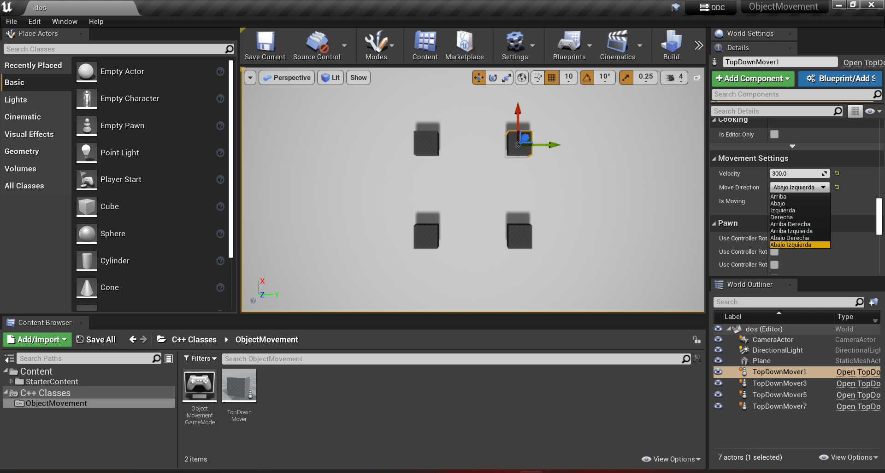
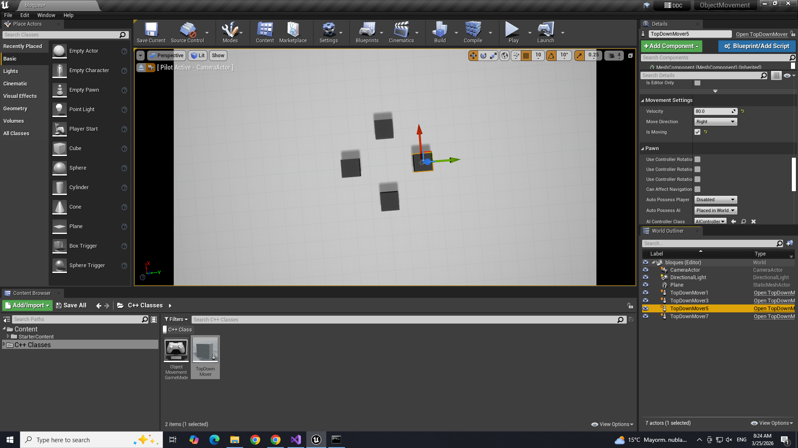
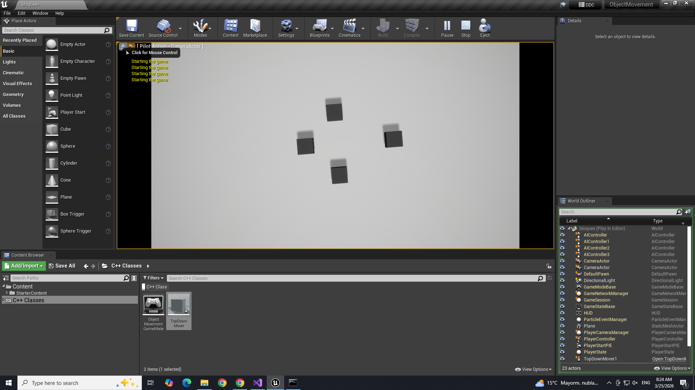

# ObjectMovement

Firs Unreal Project to learn POO.

## Capturas de pantalla

## Referencias
- https://github.com/toitolucho/ObjectMovement
- [00 Introduccion a Unreal, Creacion de un Proyecto a partir de un Template](https://youtu.be/Zzum2ixhEwk)
- [01 - Subir el proyecto a GitHub](https://youtu.be/3w4r8OggXqU)
- [02 - Configuración de una escena en blanco](https://youtu.be/DNiIboFKQHA)
- [03 - Configuración Complementaria de la Escena](https://youtu.be/WgboETo-2xQ)
- [04 - Como Configurar la clase TopDownMover para Tenerlo en la escena](https://youtu.be/o2LypOZ-vtM)
